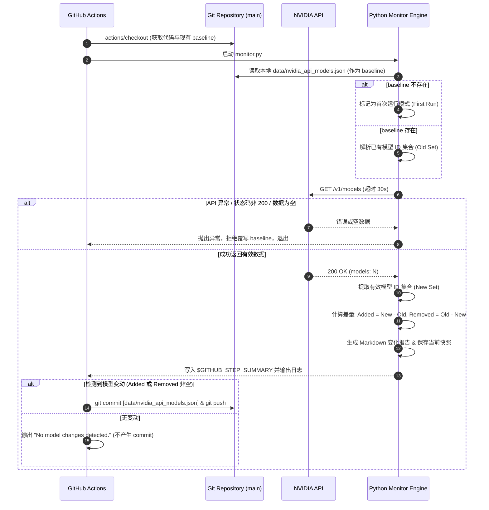

# NVIDIA Free Endpoint Monitor v2 架构分析与设计方案

本文档针对 `nvidia-free-monitor` 从 v1（定时抓取器）升级到 v2（模型变化监控器）进行系统性的架构分析与设计。

---

## 1. 当前架构问题

目前 v1 版本的核心能力是“单次无状态抓取”：
- **无状态执行**：每次 GitHub Actions 运行都在全新的 Runner 临时虚拟机中进行，工作流结束后文件系统被销毁。
- **缺乏对比基准**：当前只生成 `data/nvidia_api_models.json`，没有拉取上一份历史快照的机制，无法得知模型数量与列表的具体增删变动。
- **只报告抓取状态**：控制台日志仅能输出当前抓取到的前 20 个模型，无法直观告知运维/使用者发生了什么变化。
- **数据孤岛**：每次生成的快照以 Artifact（`nvidia-api-model-snapshot`）形式保存，Artifact 默认留存期有限（如 90 天），且不能作为本地文件在下次运行时直接读取。

---

## 2. v2 推荐架构

v2 的核心是**基于 Git 分支持久化 baseline 的无状态比对引擎**：

```
[GitHub Actions Trigger (Schedule 30m / Dispatch)]
                     │
                     ▼
       ┌───────────────────────────┐
       │ 1. 检出仓库 & 准备基准数据 │
       │    (拉取 main/data baseline)
       └─────────────┬─────────────┘
                     │
                     ▼
       ┌───────────────────────────┐
       │ 2. 获取当前 NVIDIA 模型列表 │
       │    (HTTP API 请求 + 校验) │
       └─────────────┬─────────────┘
                     │
         [API 返回有效数据 >= 阈值?]
             ├── NO  ──> [终止更新，保留旧 baseline，报错退出]
             └── YES
                     │
                     ▼
       ┌───────────────────────────┐
       │ 3. 差量计算与报告生成     │
       │    (Diff 计算: 增/删/总数) │
       └─────────────┬─────────────┘
                     │
       ┌───────────────────────────┐
       │ 4. 输出可读报告 & 存快照  │
       │    (Step Summary / stdout)│
       └─────────────┬─────────────┘
                     │
            [存在有效模型变更?]
             ├── YES ──> [自动 commit & push baseline 到仓库]
             └── NO  ──> [跳过 commit，仅更新运行日志/Artifact]
```

### 架构核心原则：
1. **可靠基准**：历史基准始终来自可信的持久化介质，不受 Runner 生命周期影响。
2. **读写分离与门禁保护**：数据抓取与基准写入之间设立强校验门禁，网络异常、空数据、服务故障绝不更新基准。
3. **变化驱动提交**：只有检测到实际模型变动时才产生 Git 提交，避免产生大量无意义的空白 commit。

---

## 3. 数据流



---

## 4. 文件结构建议

推荐将采集与比对逻辑模块化或保持轻量清晰：

```
nvidia-free-monitor/
├── .github/
│   └── workflows/
│       └── monitor.yml           # GitHub Actions 核心工作流
├── data/
│   └── nvidia_api_models.json    # 当前最新受版本控制的 baseline 快照
├── docs/
│   └── v2_architecture_analysis.md # 本设计文档
├── src/
│   ├── __init__.py               # (可选)
│   ├── monitor.py                # 监控主入口 (协调抓取、对比、保存)
│   ├── api_client.py             # (可选/内聚) NVIDIA API 请求与校验
│   └── comparator.py             # (可选/内聚) 模型集合差量对比与报告格式化
├── README.md                     # 项目说明
└── .gitignore                    # 忽略临时文件
```

> **注**：第一阶段建议保持在 `src/monitor.py` 内或拆分为 2 个文件，避免过度设计。

---

## 5. 历史快照存储方案比较

针对 GitHub Actions 环境下的持久化方案评估如下：

| 存储方案 | 实现复杂度 | 历史溯源能力 | 维护成本 | 长期稳定性 | 推荐度 |
| :--- | :--- | :--- | :--- | :--- | :--- |
| **A. 提交回 Git 主分支 (data/ 目录)** | **低**（原生 Git） | **极高**（Git 历史即变更日志） | **极低**（无外部依赖） | **极高** | ⭐⭐⭐⭐⭐ (强烈推荐) |
| **B. 独立孤立分支 (如 `data` 分支)** | 中等 | 高 | 低 | 高 | ⭐⭐⭐⭐ |
| **C. GitHub Actions Artifact** | 中等（需通过 API 下载上一 Run） | 差（最多保留 90 天，API 限流） | 高（需处理鉴权与找不到 Run 问题） | 差 | ⭐⭐ |
| **D. GitHub Actions Cache (`actions/cache`)** | 低 | 差（7天未访问淘汰，总容量 10GB 限制） | 高（Cache 命中不可靠） | 差 | ⭐ |
| **E. GitHub Releases** | 高（每次变化发 Release） | 中等 | 高（Release 过多污染仓库） | 中等 | ⭐⭐ |
| **F. 外部数据库 / 对象存储 (S3/KV)** | 高 | 高 | 很高（需配置 Token、Secret、外部服务）| 取决于外部服务 | ⭐ |

---

## 6. Artifact 是否适合作为 Previous Snapshot 数据源？

**结论：不适合。**

**深度原因分析**：
1. **生命周期短**：GitHub Artifact 默认生命周期仅 1~90 天，如果仓库较长时间无调度，Artifact 会被自动垃圾回收清理。
2. **检索复杂度高**：在当前 Runner 中获取上一次成功的 Artifact，需要调用 GitHub REST API（`GET /repos/{owner}/{repo}/actions/artifacts`），需要传入 `GITHUB_TOKEN`，且需处理跨 Run 的分页、状态过滤与 ZIP 解压。
3. **并发与竞态脆弱**：如果上一次 Workflow 失败，寻找“最近一次成功”的 Artifact 逻辑复杂且极易出错。
4. **不可见性**：在仓库主页无法直接看到当前最新的模型基准，不便于人工快速查阅和审计。

---

## 7. 方案比较与选择（Git 提交 vs Branch vs Pages vs Release）

1. **直接提交到 `main` 分支的 `data/nvidia_api_models.json`（最推荐）**：
   - **原理**：`actions/checkout` 拉取代码时自动附带了上一次提交的 `data/nvidia_api_models.json`。脚本直接比对内存中的 API 结果与本地文件。只有发现变化时，Workflow 执行 `git commit && git push`。
   - **优点**：零外部依赖；Git commit log 天然形成模型上线/下线的时间线审计日志；README 随时可引用该 JSON。
   - **防膨胀**：如果每 30 分钟无变化则不提交，通常模型变动频率在几天或几周一次，一年仅产生几十个 commit，Git 仓库极度轻量。

2. **提交到独立分支（如 `data-snapshots`）**：
   - **原理**：将代码与数据分离，数据放在独立分支。
   - **缺点**：增加了 checkout 和 push 的分支切换复杂度，对于轻量级项目收益不明显。

3. **GitHub Pages / Releases**：
   - **Releases**：过度设计，频繁发布 Release 会破坏 Release 作为版本发布的语义。
   - **Pages**：适合后续做前端展示看板，但作为后端基准存储并无额外优势。

---

## 8. 异常处理策略

为了防止网络抖动、服务降级导致误判，必须实行**防御性抓取机制**：

1. **网络超时与重试**：
   - 请求超时设置为 30 秒。
   - 增加 3 次指数退避重试（Backoff: 2s, 4s, 8s），应对偶发性 DNS 解析失败或 Connection Reset。
2. **HTTP 状态码严格拦截**：
   - 任何非 `200 OK`（如 400, 401, 403, 404, 429, 500, 502, 503, 504）立即捕获并记录错误日志。
3. **数据格式与类型安全校验**：
   - 必须校验返回的是有效 JSON。
   - 必须包含顶层 `data` 数组字段。
   - 必须能解析出有效的模型字典对象。

---

## 9. 异常响应（空列表、429、5xx）处理规范

| 异常类型 | 表现行为 | 处理动作 | 是否更新 Baseline | Workflow 状态 |
| :--- | :--- | :--- | :--- | :--- |
| **HTTP 429 Too Many Requests** | NVIDIA 接口限流 | 输出告警日志并终止 | ❌ 严禁更新 | 标记 Failed / 告警 |
| **HTTP 5xx Server Error** | NVIDIA 接口临时停机/维护 | 输出服务器错误日志并终止 | ❌ 严禁更新 | 标记 Failed |
| **返回空列表 (`"data": []`)** | API 结构异常或空数据响应 | 触发最小模型阈值拦截 | ❌ 严禁更新 | 抛出 `InvalidApiResponseError` |
| **非 JSON 响应 / HTML 拦截页** | 遇到 Cloudflare 等防爬验证 | JSON 解析异常，捕获并打印片段 | ❌ 严禁更新 | 抛出解析异常并退出 |

---

## 10. 如何避免临时 API 故障误判为“模型全部消失”？

核心是引入 **安全防跌门禁（Minimum Threshold & Drop Guard）**：

1. **绝对数量底线阈值（Minimum Count Guard）**：
   - 目前稳定模型数量约 100+。
   - 设定安全阈值（例如 `MIN_VALID_MODEL_COUNT = 10`）。若抓取到的有效模型数低于此阈值，直接判定为上游异常，拒绝进入比对流程。
2. **最大跌幅比例熔断（Drop Rate Guard）**：
   - 设定单次模型消失比例上限（如 `MAX_DROP_RATIO = 0.5`，即单次消失超过 50%）。
   - 如果检测到“消失模型”数量异常巨大，系统触发保护熔断，输出严重警告并退出，防止因上游接口分页或临时 Bug 导致基准被清空。

---

## 11. 怎么保证仅在成功获得有效模型后更新 Baseline？

采用 **原子化写盘 + 门禁校验流**：

```python
# 伪代码执行逻辑
def process():
    old_data = load_baseline_safe("data/nvidia_api_models.json")
    new_data = fetch_and_validate_models() # 内部必须通过全部状态码与阈值校验

    diff_report = compare_models(old_data, new_data)

    # 只有全部校验通过且比对完成，才写盘
    save_snapshot("data/nvidia_api_models.json", new_data)

    output_report(diff_report)
    return diff_report.has_changes()
```

如果 `fetch_and_validate_models()` 发生任何异常，程序直接非零退出，后续的写文件和 Git Push 步骤全部自动被 Actions 熔断跳过。

---

## 12. 第一次运行策略（Cold Start / No Baseline）

当仓库中尚无 `data/nvidia_api_models.json` 时：
1. **识别状态**：检测到本地无历史基准文件。
2. **行为处理**：
   - 将当前抓取到的全量模型作为初始 baseline 保存。
   - 报告输出：`[INITIAL BASELINE CREATED] Initialized baseline with N models.`。
   - 不输出“新增 N 个模型”的虚假变更，明确标明这是初始化快照。
   - 执行首次 Git Commit 将 baseline 存入仓库。

---

## 13. 后续正常运行策略

1. **读取 Baseline**：读取仓库中既有的 `data/nvidia_api_models.json`，提取模型 ID 集合 $S_{\text{old}}$。
2. **计算差集**：
   - 新增集合：$S_{\text{added}} = S_{\text{new}} - S_{\text{old}}$
   - 移除集合：$S_{\text{removed}} = S_{\text{old}} - S_{\text{new}}$
   - 数量变化：$\Delta = |S_{\text{new}}| - |S_{\text{old}}|$
3. **输出报告**：
   - 若 $S_{\text{added}} = \emptyset$ 且 $S_{\text{removed}} = \emptyset$：
     输出 `No model changes detected. Total models: N.`，跳过 Git 提交。
   - 若存在变更：
     格式化输出新增列表、移除列表，并将最新全量快照覆写到 `data/nvidia_api_models.json`，触发 Git Commit & Push。

---

## 14. 连续失败后的恢复策略

如果 NVIDIA API 连续 10 次因为网络故障报错：
- 期间 10 次运行全部在第 2 步失败退出，**历史 baseline 从未被修改**。
- 第 11 次恢复正常抓取时，它比对的基准仍然是最后一次成功时的 baseline。
- 系统能够准确计算出停机期间产生的真正变更，做到**无缝自愈（Self-healing）**，不会产生状态丢失或错误报告。

---

## 15. 并发 Workflow 处理策略

虽然每 30 分钟触发一次，但由于 Actions 排队延迟或手动触发（`workflow_dispatch`），可能会存在并发运行风险。

**防护措施**：
1. **GitHub Actions 并发组限制（Concurrency Control）**：
   在 `monitor.yml` 中添加并发组配置：
   ```yaml
   concurrency:
     group: nvidia-monitor-baseline
     cancel-in-progress: false # 顺序排队执行，避免冲突
   ```
2. **Git Push 冲突保护**：
   在提交代码前使用 `git pull --rebase`，确保多工作流按序提交。

---

## 16. 每 30 分钟运行一次的长期存储与运行影响分析

1. **运行次数与分钟数**：
   - 频率：每 30 分钟 1 次 $\rightarrow$ 每日 48 次 $\rightarrow$ 每月约 1,440 次。
   - 每次运行耗时：约 15~25 秒。
   - GitHub 公开（Public）仓库对 Actions **免费且不限分钟数**；私有仓库每月免费额度通常为 2,000 分钟（每月仅消耗约 500 分钟，远低于上限）。
2. **网络流量**：
   - 每次响应 JSON 大小约 50 KB，每日流量约 2.4 MB，极度轻量。
3. **Git 存储占用**：
   - 采用“仅变更时提交”策略，Git 对象库不会随运行次数膨胀。
   - 假设模型每年变更 50 次，每年 Git 增量小于 3 MB。

---

## 17. 如何避免历史数据无限增长？

1. **零冗余存储**：仓库中只保留一个最新状态文件 `data/nvidia_api_models.json`，不生成带时间戳的孤立历史文件（如 `data/snapshot_20260823.json`）。
2. **Git 自身存储优化**：Git 的 Packfile 压缩算法对这种结构相似的 JSON 增量存储效率极高。
3. **Artifact 留存控制**：Workflow 中的 Artifact 设置 `retention-days: 7` 或 `retention-days: 14`，自动过期清理，不占配额。

---

## 18. 最小修改方案

如果希望以最小的代码改动量实现 v2：

- **修改文件**：
  1. [src/monitor.py](file:///d:/Work/%E6%96%87%E6%A1%A3/AI/nvidia-free-monitor/src/monitor.py)：在原有脚本基础上增加 `load_previous_snapshot()`、集合差量计算函数和格式化打印。
  2. [.github/workflows/monitor.yml](file:///d:/Work/%E6%96%87%E6%A1%A3/AI/nvidia-free-monitor/.github/workflows/monitor.yml)：
     - 将 `permissions: contents: read` 改为 `contents: write`。
     - 在末尾增加 `git commit & push` 步骤（附带 `git diff --staged --quiet` 检查）。

---

## 19. 推荐方案（Robust v2）

推荐方案在最小方案基础上，补充完善的防护机制与 Step Summary 增强：

1. **带熔断与阈值校验的 Python 比对器**（保证 baseline 纯净）。
2. **同时输出到控制台与 `$GITHUB_STEP_SUMMARY`**（进入 GitHub Actions 页面一眼能看到漂亮的 Markdown 报告表格）。
3. **安全提交机制**（使用 `stefanzweifel/git-auto-commit-action` 或标准 git 脚本，仅当文件变化时提交）。
4. **并发排队控制**（`concurrency` 锁定）。

---

## 20. 推荐方案的具体实施步骤

待方案确认后，实施步骤将分为三步：

1. **第一步：重构 `src/monitor.py`**
   - 增加旧快照加载机制。
   - 增加安全阈值检验（`MIN_VALID_MODEL_COUNT`）。
   - 实现模型 ID 差集对比算法（Added / Removed / Total Diff）。
   - 实现结构化文本报告与 GitHub Step Summary 输出。
   - 保证异常时安全退出并返回状态码 1。

2. **第二步：更新 `.github/workflows/monitor.yml`**
   - 添加 `concurrency` 配置。
   - 调整 `permissions` 增加 `contents: write`。
   - 增加自动提交变更快照步骤（仅在 `data/nvidia_api_models.json` 发生变动时提交）。
   - 保留 Artifact 作为短期运行凭证。

3. **第三步：本地与云端验证**
   - 本地模拟首次运行与二次运行比对。
   - 提交推送到 GitHub，触发一次 `workflow_dispatch` 手动测试。
   - 检查 Summary 输出、Artifact 及 Git Commit 状态。

---

## 21. 示例 Workflow 输出

### 场景 A：无模型变化时的输出（99% 常态）
```text
==================================
NVIDIA Free Endpoint Monitor v2
==================================
Checked At: 2026-08-23T09:30:00Z
Total Models Fetched: 102
Baseline Models: 102

----------------------------------
Diff Summary:
- Added: 0
- Removed: 0
- Delta: 0

No model changes detected.
==================================
```

### 场景 B：检测到模型变动时的输出
```text
==================================
NVIDIA Free Endpoint Monitor v2
==================================
Checked At: 2026-08-23T10:00:00Z
Total Models Fetched: 104 (Previous: 102)

----------------------------------
Diff Summary:
- Added: 2
- Removed: 0
- Delta: +2

[+] Added Models (2):
  - meta/llama-3.3-70b-instruct
  - deepseek-ai/deepseek-r1

[-] Removed Models (0):
  (None)

Snapshot updated: data/nvidia_api_models.json
==================================
```

### 场景 C：首次运行初始化输出
```text
==================================
NVIDIA Free Endpoint Monitor v2
==================================
Checked At: 2026-08-23T09:00:00Z
Total Models Fetched: 102

[INITIAL BASELINE CREATED]
No previous baseline found. Initialized with 102 models.
Snapshot saved: data/nvidia_api_models.json
==================================
```
